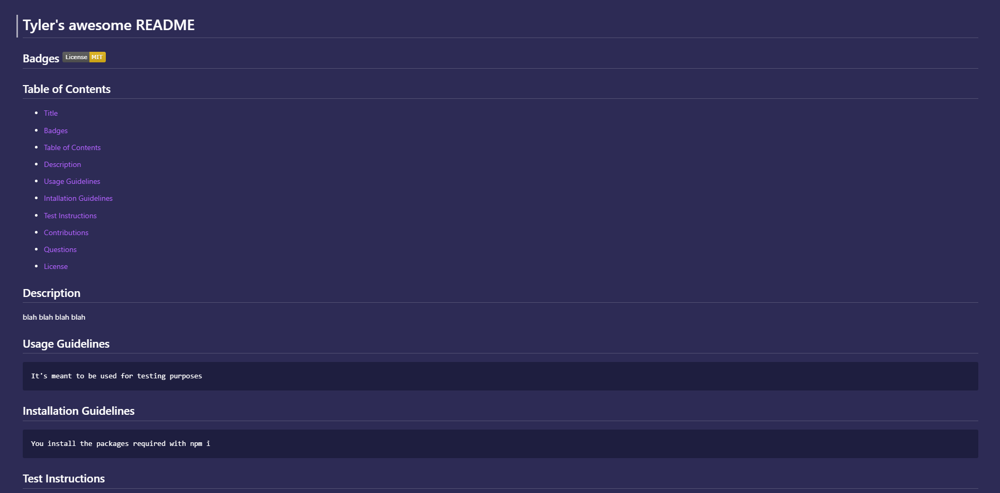

# README Generator
This is a homework assignment where I had to create a README generator.

## Description
This README generator creates a README2.md file from a series of questions asked using the inquirer package through the termial and creates a professional README.

[Here is the link](https://tywalter.github.io/readme-generator/) to the deployed website.

## Visuals 
*  Here is a screenshot of the created README2.md

* [Link to video demonstration](https://drive.google.com/file/d/1E-4jbUQIzenDJeciMUqaPYn0nWxbD3Pd/view)

## Usage
This is intended to create a professional README in record time! The prompts ask various questions and populate the README so you don't have to. This is also for grading purposes.

## Acknowledgments
Thank you to [Inquirer](https://www.npmjs.com/package/inquirer) for allowing me to use their package.

## Support
If you have any issues with this repo, shoot me an email at walterty89@gmail.com.